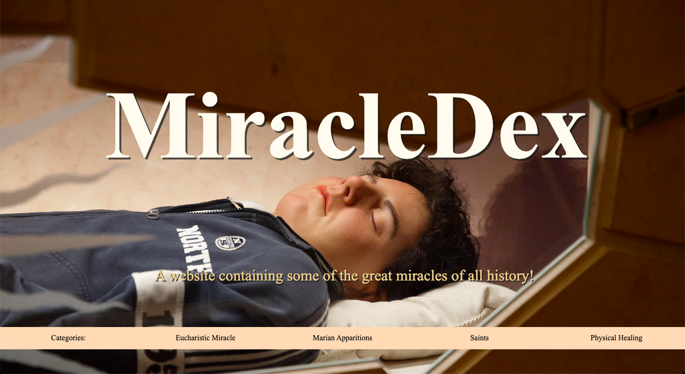
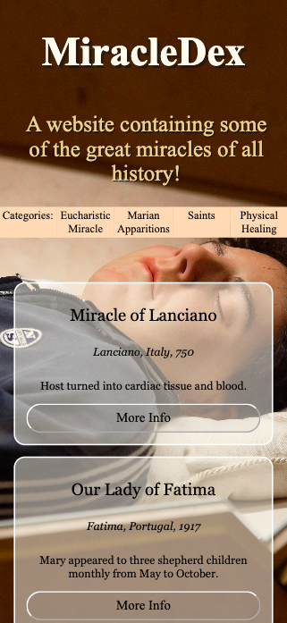
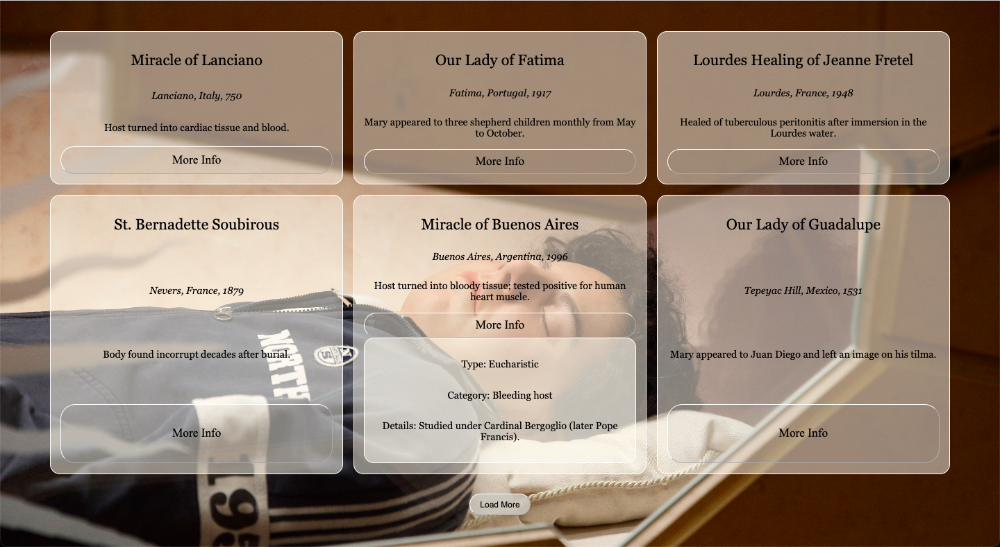

I DO NOT CONSENT TO AI ASSISTED GRADING

# ✨ MiracleDex Project Report

**Student Name:**  Martina Licheri<br>
**Course:** CSCI 270 – Web/Mobile App Development  <br>
**Project Title:** MiracleDex  <br>
**Submission Date:** Monday, June 9th<br>
**GitHub Repo:** [Paste link here]  
**Live Site (GitHub Pages):** [Paste link here]  

---

## 🔷 Part 1 — HTML/CSS Layout and Responsive Design

### ✅ Requirements Addressed
- [X] Landing page created with heading and container
- [X] Used Flexbox or Grid layout
- [X] Mobile-friendly design with media queries
- [X] Elegant, reverent styling with a Google Font
- [X] External CSS file used

### 📸 Screenshots
> Paste 1–2 screenshots showing your site on desktop and mobile.

Computer:<br><br>
<br>
<br>Phone:<br><br>


### 🔍 Code Snippets
> Include relevant HTML and CSS snippets here (layout structure, responsive styling, etc.).

HTML:
```html
<!-- This is to make the categories' menu --> 
<div class="grid">
    <div class="categories">Categories:</div>
    <div class="categories">Eucharistic Miracle</div>
    <div class="categories">Marian Apparitions</div>
    <div class="categories">Saints</div>
    <div class="categories">Physical Healing</div>
</div>

<!-- This is where I put the fetched data --> 
<div id="cards"></div>
```

CSS:
```css
/* This is how I adjusted the grid */
#cards{
    display: grid;
    grid-template-columns: repeat(3, 1fr);
    grid-column-gap: 1rem;
    grid-row-gap: 1rem;
    justify-self: center;
    padding-top: 4rem;
    width: 90%;
    justify-content: center ;
}

/* And this is the media query */
@media (max-width: 600px) {
  #cards{
    grid-template-columns: 1fr;
  }
  .grid{
    padding-top: 0;
  }
  #page{
    background-position: 45%;
  }
  .title-subtitle{
    padding-bottom: 1vw;
  }
}
```


### 🖋️ Reflection
- What challenges did you face in designing a responsive layout?

One challenged I faced was in adjusting the background picture. If it was a smaller screen, then<br>
the only visible part of the picture was his arm. Centering the image wouldn't do it either. So I<br>
had to work it out and figure out how to adjust the picture depending on the screen size.

- What did you learn about structuring HTML/CSS for real-world use?

It has much more details than I expected. Perhaps there's higher functions and styling options I am<br>
yet unaware of, but at the same time, looking at the code now (once I've finished), I realize it is<br>
fairly little code to have such a web!<br>
It gave me more practices with grids and dynamic elements. I realized that CSS can do more than<br>
I thought. Yes, it styles, but the style is very important!

---

## 🔷 Part 2 — JavaScript + DOM + JSON Integration

### ✅ Requirements Addressed
- [X] Fetched data from:  
  `https://gist.githubusercontent.com/trevortomesh/7bbf97b2fbae96639ebf1a254b6a7a70/raw/miracles.json`
- [X] Rendered miracle title, location, year, summary
- [X] Used `fetch()` and `async/await`
- [X] Implemented "Load More" or pagination
- [X] Added modal or expandable section with full miracle details

### 📸 Screenshots
> Show your miracle cards and one expanded view or modal.


### 🔍 Code Snippets
> Include the function you used to fetch the data, render the cards, and handle interaction.

```js
async function loadMiracles() {
    
    // fetch data
  const response = await fetch("https://gist.githubusercontent.com/trevortomesh/7bbf97b2fbae96639ebf1a254b6a7a70/raw/miracles.json");
  if (!response.ok) {
    throw new Error("HTTP error! Status: " + response.status);
  }
  const data = await response.json();
  const dataCards = document.getElementById("cards");
  
  // render cards
  data.forEach(card => {
    const div = document.createElement("div");
    const h1 = document.createElement("h1");
    const h2 = document.createElement("h2");
    const p = document.createElement("p");
    const button = document.createElement("button");
    h1.textContent = `${card.title}`;
    h2.textContent = `${card.location}, ${card.year}`;
    p.textContent = `${card.summary}`;
    button.textContent = `More Info`;
    div.appendChild(h1);
    div.appendChild(h2);
    div.appendChild(p);
    div.appendChild(button);
        // (...)
    
    // Show or hide modal information - handle interaction
    button.onclick = () => {
      if (div_info.style.display === "none") {
        div_info.style.display = "grid";
      } else {
        div_info.style.display = "none";
      }
    }
  })
}

// handle interaction
const loadMoreButton = document.getElementById("load-more");
loadMoreButton.addEventListener("click", async () => {
  cardAmount += 6;
  if (cardAmount > totalCards) {
    loadMoreButton.style.display = "none"; // hide button when no more cards to load
  }
  for (; count <= cardAmount; count++) {
    let div = document.getElementById(`${count}`);
    div.style.display = "grid";
  }
})

loadMiracles();
```


### 🖋️ Reflection
- What did you learn about asynchronous JavaScript? What debugging techniques did you use or discover?<br>

It helps you run other things while you are executing a certain task/function.<br>
I noticed it in that the web didn't wait for the background image to load to display the initial 6 cards.

---

## 🔷 Part 3 — GitHub Repository and Documentation

### ✅ Requirements Addressed
- [ ] GitHub repo created and pushed
- [ ] GitHub Pages deployed
- [ ] `README.md` contains project description, instructions, and screenshots

### 📎 Links
- **GitHub Repo:** [Paste link here]  
- **Live GitHub Pages Site:** [Paste link here]

### 🖋️ Reflection
How did using GitHub affect your development process? What new Git or GitHub skills did you gain?

---

## 🧠 Final Reflection

*Imagine you're explaining this project to a friend who doesn’t code.<br>
What does your app do? What are you most proud of? What was the hardest part to get working?*

*Reflect on both the technical and the spiritual aspects of building a project about Catholic miracles.*

---

<sub>Assignment created by Dr. Trevor Tomesh with assistance from ChatGPT.<br>
All source miracle data provided from public JSON:<br> https://gist.github.com/trevortomesh/7bbf97b2fbae96639ebf1a254b6a7a70</sub>